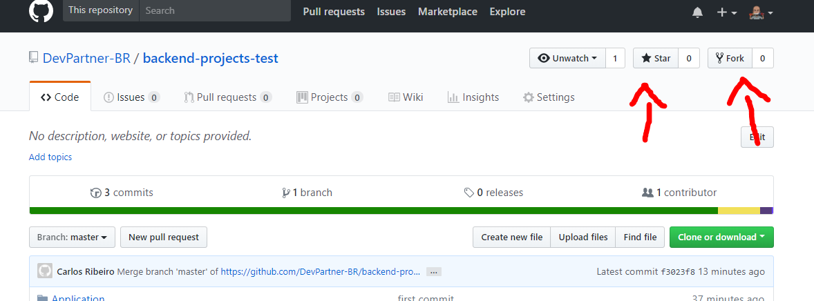

# | Backend na DevPartner

## | Sobre a DevPartner

A relação de parceria estabelecida com o cliente é o ativo mais importante para a DevPartner. É o motor que leva a empresa a conhecer a fundo os negócios do cliente e, junto com ele, desenhar a melhor solução que atenda as suas necessidades.

"A nossa filosofia é a de viver o dia a dia do cliente, conhecer o seu negócio, estar ao seu lado e compreender as suas necessidades para ter a certeza de que vamos produzir o melhor resultado. Ser parceiro é isso!"  
 ***Eduardo Silvestri, Presidente da [DevPartner](http://devpartner.com.br/)***

## | Teste BackEnd para o DevPartner
O teste consiste em entendermos um pouco mais sobre seus conhecimentos com [C-Sharp](https://docs.microsoft.com/en-us/dotnet/csharp/), [.NETFramework](https://docs.microsoft.com/en-us/dotnet/framework/),
[Entity Framework](https://docs.microsoft.com/en-us/ef/),[Aspnet](https://docs.microsoft.com/en-us/aspnet/), [Asp.Net Web API](https://www.asp.net/web-api) e lógica de programação.

## | Orientações
Primeiramente, faça um fork e clone do projeto;
Crie uma branch com o seu nome e sobre nome e depois instale as dependências.   

**1. Dê um like e um Fork =)**



**2. Clone do Projeto**
```sh
git clone "https://github.com/**seu-usuario**/backend-test.git"
```
*no lugar do "seu-usuario" coloque o seu usuário do github :)

**3. Criando nova Branch**
```sh
git checkout -b "meunomeEsobrenome"
```
**4. Instalando as dependências**

Abra o projeto clicando no arquivo *devpartner.sln*. Com o projeto aberto no visual studio, basta abrir Package Manager Console (clique no menu {**ferramentas** ou **Tools**} e depois em {**gerenciador de pacotes** ou **Package Manager**}, enfim em {**gerenciador de pacotes console** ou **Package Manager Console**} ) agora é só digitar o comando.

```sh
Update-Package
```

**5. Agora é rodar a aplicação**

F5
*simples assim*

***Observação:** fique a vontade para persistir os dados no banco que for da sua preferência. Aqui usamos MS-SQL e similares mas também curtimos NOSQL*

## | O que precisa ser feito ?

CRUD em Web API de notas fiscais, simples não ?

***Objeto: notaFiscalId, numeroNf, valorTotal, dataNf, cnpjEmissorNf e cnpjDestinatarioNf***

Não se sentiu a vontade com a estrutura do projeto ? **Não tem problema**, pode começar um projeto do zero, do seu jeito. Consideramos importante você dominar os conceitos e não as ferramentas "A" ou "B".

### Terminou e quer enviar para a DevPartner ?

1. Construa uma collection em postman para testarmos suas APIs.
2. Se for preciso modificar a estrutura e workflow, atualizar o README.
3. Submeta o Pull Request e envie um email para **fabiana.carvalhal@devpartner.com.br e allan.ferraz@devpartner.com.br** :D

## | O que acontece depois ?

Avaliaremos a sua **Pull Request** e, se estiver atendendo os requisitos obrigatórios, marcaremos uma apresentação do exercício, afinal de contas, ninguém melhor que o próprio desenvolvedor para explicar o seu projeto =)
*fique tranquilo já passamos por isso também*

## | Requisitos obrigatórios
1. Escrever o código em C-Sharp  ;)
2. Projeto deve ser obrigatóriamente em WebAPI
3. CRUD funcionando!
4. Procure manter a estrutura do projeto.

## | Requisitos extras 
1. Automação de testes - unitários e integração. (Vamos adorar! :D)
2. Documentação dos endpoints
3. Performance

## | Quer impressionar ?
1. Melhore nosso projeto base para testes de back-end (*melhorias relevantes, por favor*)
2. Demonstre domínio na stack proposta (**menos *bla bla bla*** e **mais código**)

## | Ferramenta de Desenvolvimento

Fique a vontade para usar a ferramenta que for mais confortável para você ;)   
Aqui usamos muito o [Visual Studio](https://www.visualstudio.com/) e [VS Code](https://code.visualstudio.com/).


<sub>Os dados presentes neste teste são totalmente fictícios.</sub>
